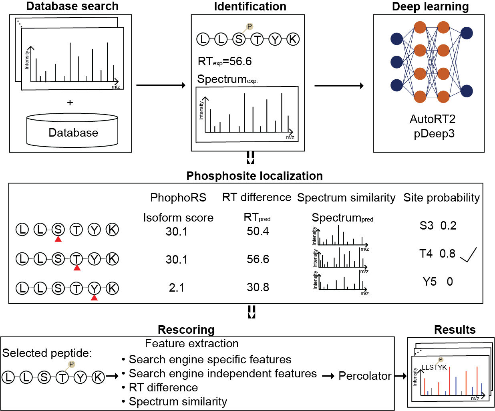

# DeepRescore2

## Overview

#### DeepRescore2: a novel post-processing tool by combing deep learning derived predictions, retention time and spectrum similarity, to facilitate the phosphosite localization and rescore peptide spectrum matches. 


## Pipeline



## Table of contents:

- [Installation](#Installation)
- [Usage](#Usage)
- [How to cite](#How-to-cite)

## Installation
DeepRescore2 is built based on python, R and docker on the Windows system. Its dependencies can be installed via
```shell
$ pip install -r requirements.txt
```

#### Download DeepRescore2

```shell
$ git clone https://github.com/bzhanglab/DeepRescore2
```

#### System requirements

* Windows systems

#### Install software

* Install Java
* Install R
* Install python >= 3.5 with pandas module
* Install [Docker](https://docs.docker.com/install/) (>=19.03).
* Install [pDeep3](https://github.com/pFindStudio/pDeep3)
* Install [AutoRT](https://github.com/bzhanglab/AutoRT)


## Usage

The user has to change the DeepRescore2 parameter file named "DeepRescore2.param" before using DeepRescore2. All the parameters are list as follows:
```R
Rscript DeepRescore2.R -h
optional arguments:
-h, --help            show this help message and exit
-i IDENTIFICATION, --identification IDENTIFICATION
                        Path to the search engine identification file
-o OUT_DIR, --out_dir OUT_DIR
                        Output directory
-r RAW_DIR, --raw_dir RAW_DIR
                        Path to the MS/MS spectra (RAW) directory
-m MGF_DIR ---mgf_dir MGF_DIR
                        Path to the MS/MS spectra (MGF) directory
-db DATABASE --database DATABASE
                        Path to the database used for searching
-dp DECOY_PREFIX --decoy_prefix DECOY_PREFIX
                        Decoy prefix used for searching. Default is XXX_
-s SEARCH_ENGINE --search_engine SEARCH_ENGINE
                        msgf, comet, xtandem, maxquant
-f FILE_FORMAT --file_format FILE_FORMAT
                        Identification file format (mzIdentML: 1, pepXML: 2, proBAM: 3, txt: 4, maxQuant: 5, TIC: 6)
```

## Input

## Output

## How to cite

