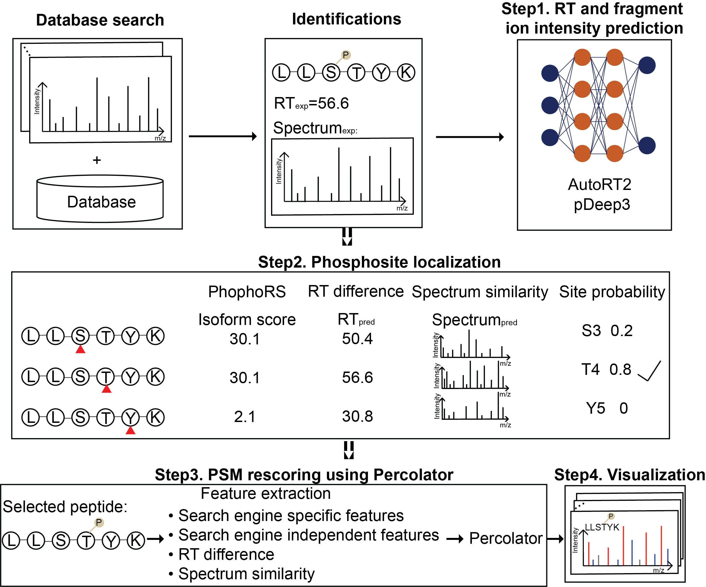

# DeepRescore2

## Overview

#### DeepRescore2: a novel post-processing tool by combing deep learning derived predictions, retention time and spectrum similarity, to facilitate the phosphosite localization and rescore peptide spectrum matches. The current version supports four search engines, [MS-GF+ (v2019.02.28)](https://github.com/MSGFPlus/msgfplus), [Comet (2018.01 rev.4)](http://comet-ms.sourceforge.net/), [X!Tandem (v2017.2.1.2)](https://www.thegpm.org/TANDEM/), and [MaxQuant (v1.6.5.0)](https://maxquant.org/).


## Pipeline



## Table of contents:

- [Installation](#Installation)
- [Usage](#Usage)
- [Input](#Input)
- [Output](#Output)
- [Other functions](#Other-functions)
- [How to cite](#How-to-cite)

## Installation

#### Supported Operating Systems
* Windows systems. To meet the Docker Desktop requirements, the Windows system needs to be running Windows 10 Pro, Enterprise, or Home (18363+) as the operating system version.

#### Hardware Requirements
* DeepRescore2 does not require GPUs for its execution. It can run efficiently on standard CPU-based systems. However, utilizing a GPU can potentially accelerate the processing time for certain operations, providing performance optimization.

#### Computational Time
* The computational time required by DeepRescore2 is dependent on various factors, such as the size of the dataset and the specific hardware configuration.
* Due to the involvement of deep learning models, DeepRescore2 may require more computational time than traditional search engine + localization steps.
* For the synthetic dataset, it took approximately 2 hours to complete the analysis using a Windows machine.
* For the UCEC TMT dataset, the analysis required approximately 9 hours to complete using a Windows machine.

#### Programmatic Interface
* DeepRescore2 provides a command-line interface (CLI) for users to execute the workflow.

#### Programming Language and Framework 
* DeepRescore2 is implemented using Python, R, and shell programming languages. It relies on multiple libraries and frameworks as listed below
* Install Java
* Install R with [tidyverse](https://www.tidyverse.org/packages/), [XML](https://cran.r-project.org/web/packages/XML/index.html), [data.table](https://cran.r-project.org/web/packages/data.table/index.html) package installed.
* Install python >= 3.5 with pandas module
* Install [Docker](https://docs.docker.com/install/) (>=19.03).
* Install [pDeep3](https://github.com/pFindStudio/pDeep3) under conda environment named 'pDeep3'. Tensorflow version 1.13.1 is required.
* Install [AutoRT](https://github.com/bzhanglab/AutoRT). Tensorflow version 2.6.0 is required.

#### Data type
* Instrument Type: The proposed approach, DeepRescore2, is designed to be applicable to mass spectrometry-based proteomics data obtained from various types of instruments, including but not limited to Orbitrap, Q-TOF, and ion trap instruments.
* Peptide Type: DeepRescore2 is applicable to different types of peptides, including both labeled (e.g., TMT-labeled) and unlabeled peptides. However, it is important to note that DeepRescore2 is specifically designed to handle peptides with phosphorylation modification.
* Computational Requirements: Currently, DeepRescore2 only supports running on Windows systems. The computational requirements for running DeepRescore2 depend on the size of the dataset and the specific hardware configuration. DeepRescore2 utilizes deep learning models, and the computational demands may increase with larger datasets. We recommend running DeepRescore2 on a machine with sufficient computational resources, such as a multi-core CPU and a GPU, to ensure efficient processing.


#### Download DeepRescore2

```shell
$ git clone https://github.com/bzhanglab/DeepRescore2
```

## Usage

The user has to edit the DeepRescore2 parameter file named "DeepRescore2.param" before using DeepRescore2. The command line to run DeepRescore2 is:

```R
Rscript DeepRescore2.R DeepRescore2.param
```

Each column of the parameter file is described as follows (Please change the 'Value' column based on your data):
| Name  | Value | Description |
| -------------  | ------------- | ------------- |
| DeepRescore2Path  | DEEPRESCORE2_DIR  | DeepRescore2 directory |
| javaPath  | JAVA_DIR  | Java directory |
| pythonPath  | PYTHON_DIR  | Python directory |
| decoyPrefix  | DECOY_PREFIX  | Decoy prefix used for searching. Default is XXX_ |
| searchEngine  | SEARCH_ENGINE  | Four search engines, msgf, comet, xtandem, maxquant, are supported |
| inputPath  | INPUT_DIR  | Input directory including all the input files |
| rawSpectraPath  | RAW_DIR  | Path to the MS/MS spectra (RAW) directory |
| spectraPath  | MGF_DIR  | Path to the MS/MS spectra (MGF) directory |
| databasePath  | DATABASE_DIR  | Path to the database used for searching |
| inputFeaturePath  | FEATURE_DIR  | Path to the feature matrix |
| outputPath  | OUT_DIR  | Output directory |
| VariableMods  | VAR_MOD  | Variable modifications used for searching, e.g. '1,Oxidation,M,15.994919,1;2,Phospho,S,79.966331,2;3,Phospho,T,79.966331,2;4,Phospho,Y,79.966331,2' |
| FixedMods  | Fix_MOD  | Fixed modifications used for searching, e.g. '5,Carbamidomethyl,C,57.021464,3'. If null, use 'null' |
| ModsReplace  | RENAME_MOD  | Some modifications need to rename, e.g. '[79.966331],Phospho'. If null, use 'null' |

As a reference, we prepared 9 parameter files for the three test datasets of four search engines used in our manuscript, including label free dataset (PRIDE ID: PXD000138 and PXD023665) and UCEC TMT dataset, respectively. Please check the 'Parameters' folder.

## Input

#### Generate feature matrix as input

Please prepare a feature matrix including all the necessary features as follows:

<table>
  <tr>
    <th rowspan="1">Feature groups</th>
    <th>Feature name</th>
    <th>Feature description</th>
  </tr>
  <tr>
    <td rowspan="2">Features based on deep learning</td>
    <td>RT Ratio</td>
    <td>RT ratio  between observed RT and predicted RT</td>
  </tr>
  <tr>
    <td>Spectrum similarity</td>
    <td>The spectral similarity characterized by entropy distance between predicted MS/MS spectrum and experimental MS/MS spectrum of a peptide</td>
  </tr>
  <tr>
    <td rowspan="7">Search engine independent features</td>
    <td>Mass_Error</td>
    <td>Difference between theoretical and experimental mass</td>
  </tr>
  <tr>
    <td>Charge</td>
    <td>Peptide charge</td>
  </tr>
  <tr>
    <td>Abs_Mass_Error</td>
    <td>Absolute value of the difference between theoretical and experimental mass</td>
  </tr>
  <tr>
    <td>Ln_Total_Intensity</td>
    <td>Total intensity, natural logarithm transformed</td>
  </tr>
  <tr>
    <td>Match_Ions_Intensity</td>
    <td>Total intensity of matched ions, natural logarithm transformed</td>
  </tr>
  <tr>
    <td>Max_Match_Ion_Intensity</td>
    <td>Max intensity of matched fragment ions</td>
  </tr>
  <tr>
    <td>Rel_Match_Ions_Intensity</td>
    <td>The total intensity of all matched ions divided by the total intensity of the spectrum</td>
  </tr>
  <tr>
    <td rowspan="5">Search engine specific features (Comet (2018.01 rev.4))</td>
    <td>xcorr</td>
    <td>Cross-correlation of the experimental and theoretical spectra</td>
  </tr>
  <tr>
    <td>deltacn</td>
    <td>The normalized difference of XCorr values between the best sequence and the next best sequence</td>
  </tr>
  <tr>
    <td>spscore</td>
    <td>The spscore of Comet</td>
  </tr>
  <tr>
    <td>sprank</td>
    <td>The sprank score of Comet</td>
  </tr>
  <tr>
    <td>Ln_expect</td>
    <td>Comet  Evalue, natural logarithm transformed</td>
  </tr>
  <tr>
    <td rowspan="3">Search engine specific features (MaxQuant (v1.6.5.0))</td>
    <td>Score</td>
    <td>Andromeda score</td>
  </tr>
  <tr>
    <td>Ln-PEP</td>
    <td>Posterior Error Probability of the identification, natural logarithm transformed</td>
  </tr>
  <tr>
    <td>Delta_Score</td>
    <td>Score difference to the second best identified peptide</td>
  </tr>
  <tr>
    <td rowspan="4">Search engine specific features (MS-GF+ (v2019.02.28))</td>
    <td>MS-GF:RawScore</td>
    <td>Raw match score of MS-GF+</td>
  </tr>
  <tr>
    <td>MS-GF:DeNovoScore</td>
    <td>Maximum possible raw match score to this spectrum</td>
  </tr>
  <tr>
    <td>MS-GF:SpecEValue</td>
    <td>Negative MS-GF+ Spectral E Value, logged</td>
  </tr>
  <tr>
    <td>Ln-MS-GF:EValue</td>
    <td>Negative MS-GF+ E value, logged</td>
  </tr>
  <tr>
    <td rowspan="2">Search engine specific features (X!Tandem (v2017.2.1.2))</td>
    <td>Ln-X!Tandem:expect</td>
    <td>X!Tandem  Evalue, natural logarithm transformed</td>
  </tr>
  <tr>
    <td>X!Tandem:hyperscore</td>
    <td>X!Tandem hyperscore</td>
  </tr>
</table>

We used PDV (PDV-1.6.1.beta.features-jar-with-dependencies.jar) attached under the 'Script/GenerateFeatureMatrix' folder to generate feature matrix. The script to run this jar file based on the Comet (2018.01 rev.4) identifications is as follows:

```sh
java -Xmx100g -jar ./Script/GenerateFeatureMatrix/PDV-1.6.1.beta.features-jar-with-dependencies.jar \
	-r ./ExampleData/PXD023665/Comet.pep.xml \
	-rt 2 \
	-s ./ExampleData/Combined.mgf \
	-st 1 \
	-i * \
	-k s \
	-o . \
	-a 0.02 \
	-c 0 \
	-decoy REV_ \
	-ft pdf \
	--features

```

As a reference, we uploaded all the input data used in our manuscript, including two label free datasets (PRIDE ID: PXD000138 and PXD023665) and one TMT datasets (UCEC) into the zenodo website under the [ExampleData](https://zenodo.org/) folder.

## Output

DeepRescore2 will output results of each step, including
* Features
* PhosphoRS
* PGA
* generate_train_prediction
* autoRT_Results
* pDeep3_Results
* Percolator

DeepRescore2 also output two tables as the final results: 
* File named 'Method1Results.txt' which is filtered using both PGA FDR < 1% and PhosphoRS localization probability > 0.75.
* File named 'DeepRescore2Results.txt' which is filtered using both q-value < 1% and DeepLocalization probability > 0.75.

## Other functions

#### Quantification for TMT dataset

In our manuscript, we used [MASCI](https://github.com/PNNL-Comp-Mass-Spec/MASIC) to perform the TMT quantification for both TMT10 (UCEC) and TMT11 (HCC) datasets. We prepared the original scripts we used for the quantification under the 'Script/TMTQuantification' folder. You can change the input data path and parameters used for MASCI following our scripts to do the TMT quantification.

## How to cite

Yi, Xinpei, Wen Bo, Shuyi Ji, Alexander B. Saltzman, Eric J. Jaehnig, Jonathan T. Lei, Qiang Gao, and Bing Zhang (2023), **Deep learning prediction boosts phosphoproteomics-based discoveries through improved phosphopeptide identification**. *bioRxiv*. [doi:10.1101/2023.01.11.523329](https://doi.org/10.1101/2023.01.11.523329)

