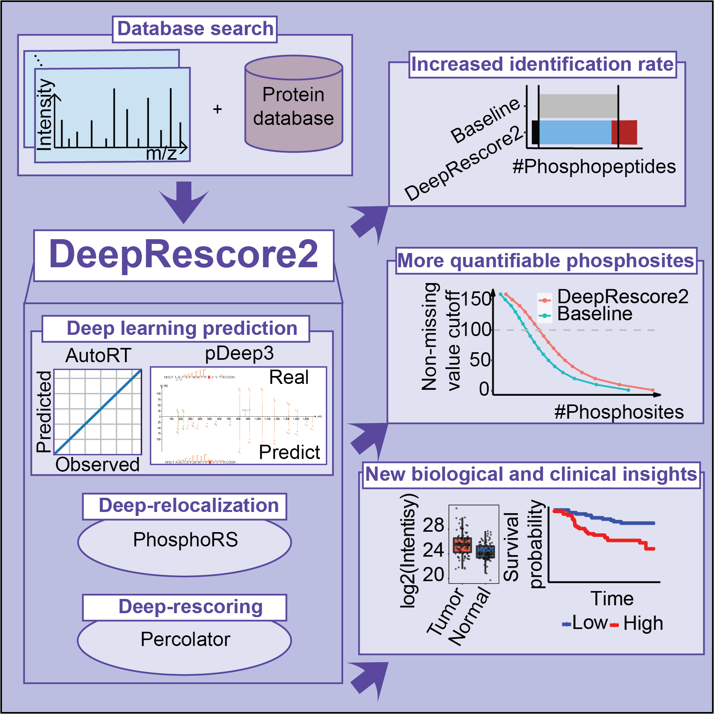

# DeepRescore2: deep learning prediction boosts phosphoproteomics-based discoveries through improved phosphopeptide identification



**Shotgun phosphoproteomics** enables high-throughput analysis of phosphopeptides in biological samples. One of the primary challenges associated with this technology is the relatively low rate of phosphopeptide identification during data analysis. This limitation hampers the full realization of the potential offered by shotgun phosphoproteomics. Here we present **DeepRescore2**, a computational workflow that leverages **deep learning-based retention time and fragment ion intensity predictions** to improve **phosphopeptide identification** and **phosphosite localization**. Using a state-of-art computational workflow as a benchmark, DeepRescore2 increases the number of correctly identified peptide-spectrum matches by 17% in a synthetic dataset and identifies 19%-46% more phosphopeptides in biological datasets. In a liver cancer dataset, 30% of the significantly altered phosphosites between tumor and normal tissues and 60% of the prognosis-associated phosphosites identified from DeepRescore2-processed data could not be identified based on the state-of-the-art workflow. Notably, DeepRescore2-processed data uniquely identifies EGFR hyperactivation as a new target in poor-prognosis liver cancer, which is validated experimentally. Integration of deep learning prediction in DeepRescore2 improves phosphopeptide identification and facilitates biological discoveries.

## Contents

- [Directory structure of DeepRescore2](#directory-structure-of-deeprescore2)
- [Customize environment for DeepRescore2](#customize-environment-for-deeprescore2)
  - [Our DeepRescore2 environment](#our-DeepRescore2-environment)
  - [Computational Time](#computational-time)
  - [Installation](#installation)
  - [Data type](#data-type)
- [Implement DeepRescore2](#implement-deeprescore2)
  - [Download example data](#download-example-data)
  - [Directory structure of input](#directory-structure-of-input) 
  - [Parameters of DeepRescore2](#parameters-of-deeprescore2)
  - [Run DeepRescore2](#run-deeprescore2)
- [Output](#output)
- [Other functions](#Other-functions)
  - [Quantification for TMT dataset](#quantification-for-tmt-dataset)
  - [Kinase activity score inference](#kinase-activity-score-inference) 
- [Contact](#contact)
- [References](#references)

## Directory structure of DeepRescore2
```
DeepRescore2
|---Script
|---|---DeepRelocalization
|---|---Features
|---|---generate_train_prediction
|---|---GenerateFeatureMatrix
|---|---KinaseActivityScoreInference
|---|---pDeep3
|---|---Percolator
|---|---PGA
|---|---PhosphoRS
|---|---TMTQuantification
|---|---DeepRescore2.sh
|---Parameters
|---|---PXD000138_maxquant.param
|---|---PXD023665_comet.param
|---|---PXD023665_maxquant.param
|---|---PXD023665_msgf.param
|---|---PXD023665_xtandem.param
|---|---UCEC_comet.param
|---|---UCEC_maxquant.param
|---|---UCEC_msgf.param
|---|---UCEC_xtandem.param
|---Install
|---|---Install.sh
|---|---environment_R.yml
```
- **Script** implements DeepRescore2 to improve phosphopeptide identification and phosphosite localization.
- **Parameters** include 9 parameter files for the three test datasets of four search engines used in our manuscript, including label free dataset (PRIDE ID: PXD000138 and PXD023665) and UCEC TMT dataset, respectively.
- **Install** includes scripts for installing DeepRescore2, e.g., configuring the deep learning conda environment, and installing R packages.

## Customize environment for DeepRescore2
### Our DeepRescore2 environment
- Windows 10 64bit. To meet the Docker Desktop requirements, the Windows system needs to be running Windows 10 Pro, Enterprise, or Home (18363+) as the operating system version.
- [Git](https://git-scm.com/downloads). To provide command-line interface (CLI) for users to execute the workflow, the Git on Windows system needs to be installed.
- [Docker Desktop](https://docs.docker.com/install/). Both [PGA](https://github.com/wenbostar/PGA) and [Percolator](https://github.com/percolator/percolator) were installed using Docker.
- [Anaconda](https://www.anaconda.com/download). We built three conda environments for [AutoRT](https://github.com/bzhanglab/AutoRT), [pDeep3](https://github.com/pFindStudio/pDeep3) and R, respectively, to meet the requirements of different environment verisons, e.g. tensorflow.

### Computational Time
- The computational time required by DeepRescore2 is dependent on various factors, such as the size of the dataset and the specific hardware configuration.
- Due to the involvement of deep learning models, DeepRescore2 may require more computational time than traditional search engine + localization steps.
- For the synthetic dataset, it took approximately 2 hours to complete the analysis using a Windows machine.
- For the UCEC TMT dataset, the analysis required approximately 9 hours to complete using a Windows machine.

### Installation
- Download Git on the windows system： https://git-scm.com/downloads Right-click the mouse to open the Git Bash. **Please install and run DeepRescore2 under Git Bash as an administrator.**
- Install [Docker Desktop for Windows system](https://docs.docker.com/install/) (>=19.03).
- Install [Anaconda for Windows system](https://www.anaconda.com/download) and get the Conda path (default is in /C/ProgramData/anaconda3).
- Download and install DeepRescore2 in your folder.
```
$ git clone https://github.com/bzhanglab/DeepRescore2.git
$ cd DeepRescore2
$ ./Install/InstallDependency.sh . $AnacondaPath
```
**After installation, please verify whether the AutoRT, pDeep3, and R_env conda environments exist in the Anaconda environment folder (typically located at C:\ProgramData\anaconda3\envs) or not.**

### Data type
- Instrument Type: The proposed approach, DeepRescore2, is designed to be applicable to mass spectrometry-based proteomics data obtained from various types of instruments, including but not limited to Orbitrap, Q-TOF, and ion trap instruments.
- Peptide Type: DeepRescore2 is applicable to different types of peptides, including both labeled (e.g., TMT-labeled) and unlabeled peptides. However, it is important to note that DeepRescore2 is specifically designed to handle peptides with phosphorylation modification.
- The current version supports four search engines, [MS-GF+ (v2019.02.28)](https://github.com/MSGFPlus/msgfplus), [Comet (2018.01 rev.4)](http://comet-ms.sourceforge.net/), [X!Tandem (v2017.2.1.2)](https://www.thegpm.org/TANDEM/), and [MaxQuant (v1.6.5.0)](https://maxquant.org/).
- Computational Requirements: Currently, DeepRescore2 only supports running on Windows systems. The computational requirements for running DeepRescore2 depend on the size of the dataset and the specific hardware configuration. DeepRescore2 utilizes deep learning models, and the computational demands may increase with larger datasets. We recommend running DeepRescore2 on a machine with sufficient computational resources, such as a multi-core CPU and a GPU, to ensure efficient processing.

## Implement DeepRescore2

### Download example data
- Please go to https://zenodo.org/records/10049730 and download **ExampleData1.zip (Synthetic dataset, PXD000138)**, **ExampleData2.zip (Label free dataset, PXD023665)**, **ExampleData3.zip (TMT dataset, UCEC)** used in our manuscript. Unzip these files as the input for DeepRescore2. 

### Directory structure of input
In order to perform DeepRescore2, the input dataset for DeepRescore2 must be prepared as follows.
```
|---Raw_input_directory
|---|---MGF
|---|---|---Spectra1.mgf
|---|---|---Spectra2.mgf
             ...
|---|---|---SpectraN.mgf
|---|---RAW
|---|---|---Spectra1.raw
|---|---|---Spectra2.raw
             ...
|---|---|---SpectraN.raw
|---|---features_matrix.txt
```
- **MGF** includes the MS/MS spectra (MGF format).
- **RAW** includes the MS/MS spectra (RAW format).
- **features_matrix.txt** is the path to the feature matrix which contains all the necessary features as follows:

<table>
  <tr>
    <th rowspan="1">Feature groups</th>
    <th>Feature name</th>
    <th>Feature description</th>
  </tr>
  <tr>
    <td rowspan="2">Features based on deep learning</td>
    <td>RT Ratio</td>
    <td>RT ratio  between observed RT and predicted RT</td>
  </tr>
  <tr>
    <td>Spectrum similarity</td>
    <td>The spectral similarity characterized by entropy distance between predicted MS/MS spectrum and experimental MS/MS spectrum of a peptide</td>
  </tr>
  <tr>
    <td rowspan="7">Search engine independent features</td>
    <td>Mass_Error</td>
    <td>Difference between theoretical and experimental mass</td>
  </tr>
  <tr>
    <td>Charge</td>
    <td>Peptide charge</td>
  </tr>
  <tr>
    <td>Abs_Mass_Error</td>
    <td>Absolute value of the difference between theoretical and experimental mass</td>
  </tr>
  <tr>
    <td>Ln_Total_Intensity</td>
    <td>Total intensity, natural logarithm transformed</td>
  </tr>
  <tr>
    <td>Match_Ions_Intensity</td>
    <td>Total intensity of matched ions, natural logarithm transformed</td>
  </tr>
  <tr>
    <td>Max_Match_Ion_Intensity</td>
    <td>Max intensity of matched fragment ions</td>
  </tr>
  <tr>
    <td>Rel_Match_Ions_Intensity</td>
    <td>The total intensity of all matched ions divided by the total intensity of the spectrum</td>
  </tr>
  <tr>
    <td rowspan="5">Search engine specific features (Comet (2018.01 rev.4))</td>
    <td>xcorr</td>
    <td>Cross-correlation of the experimental and theoretical spectra</td>
  </tr>
  <tr>
    <td>deltacn</td>
    <td>The normalized difference of XCorr values between the best sequence and the next best sequence</td>
  </tr>
  <tr>
    <td>spscore</td>
    <td>The spscore of Comet</td>
  </tr>
  <tr>
    <td>sprank</td>
    <td>The sprank score of Comet</td>
  </tr>
  <tr>
    <td>Ln_expect</td>
    <td>Comet  Evalue, natural logarithm transformed</td>
  </tr>
  <tr>
    <td rowspan="3">Search engine specific features (MaxQuant (v1.6.5.0))</td>
    <td>Score</td>
    <td>Andromeda score</td>
  </tr>
  <tr>
    <td>Ln-PEP</td>
    <td>Posterior Error Probability of the identification, natural logarithm transformed</td>
  </tr>
  <tr>
    <td>Delta_Score</td>
    <td>Score difference to the second best identified peptide</td>
  </tr>
  <tr>
    <td rowspan="4">Search engine specific features (MS-GF+ (v2019.02.28))</td>
    <td>MS-GF:RawScore</td>
    <td>Raw match score of MS-GF+</td>
  </tr>
  <tr>
    <td>MS-GF:DeNovoScore</td>
    <td>Maximum possible raw match score to this spectrum</td>
  </tr>
  <tr>
    <td>MS-GF:SpecEValue</td>
    <td>Negative MS-GF+ Spectral E Value, logged</td>
  </tr>
  <tr>
    <td>Ln-MS-GF:EValue</td>
    <td>Negative MS-GF+ E value, logged</td>
  </tr>
  <tr>
    <td rowspan="2">Search engine specific features (X!Tandem (v2017.2.1.2))</td>
    <td>Ln-X!Tandem:expect</td>
    <td>X!Tandem  Evalue, natural logarithm transformed</td>
  </tr>
  <tr>
    <td>X!Tandem:hyperscore</td>
    <td>X!Tandem hyperscore</td>
  </tr>
</table>

We used PDV (PDV-1.6.1.beta.features-jar-with-dependencies.jar) attached under the 'Script/GenerateFeatureMatrix' folder to generate feature matrix. The script to run this jar file based on the Comet (2018.01 rev.4) identifications is as follows:

```sh
java -Xmx100g -jar ./Script/GenerateFeatureMatrix/PDV-1.6.1.beta.features-jar-with-dependencies.jar \
  -r ./ExampleData/PXD023665/Comet.pep.xml \
  -rt 2 \
  -s ./ExampleData/Combined.mgf \
  -st 1 \
  -i * \
  -k s \
  -o . \
  -a 0.02 \
  -c 0 \
  -decoy REV_ \
  -ft pdf \
  --features

```

### Parameters of DeepRescore2
Each column of the parameter file is described as follows (Please change the 'Value' column based on your data):
| Name  | Value | Description |
| -------------  | ------------- | ------------- |
| DeepRescore2Path  | DEEPRESCORE2_DIR  | DeepRescore2 directory |
| anacondaPath  | ANACONDA_DIR  | Anaconda directory. Default is /C/ProgramData/anaconda3 |
| decoyPrefix  | DECOY_PREFIX  | Decoy prefix used for searching. Default is XXX_ |
| searchEngine  | SEARCH_ENGINE  | Four search engines, msgf, comet, xtandem, maxquant, are supported |
| rawSpectraPath  | RAW_DIR  | Path to the MS/MS spectra (RAW) directory |
| spectraPath  | MGF_DIR  | Path to the MS/MS spectra (MGF) directory |
| inputFeaturePath  | FEATURE_DIR  | Path to the feature matrix |
| outputPath  | OUT_DIR  | Output directory |
| VariableMods  | VAR_MOD  | Variable modifications used for searching, e.g. '1,Oxidation,M,15.994919,1;2,Phospho,S,79.966331,2;3,Phospho,T,79.966331,2;4,Phospho,Y,79.966331,2' |
| FixedMods  | Fix_MOD  | Fixed modifications used for searching, e.g. '5,Carbamidomethyl,C,57.021464,3'. If null, use 'null' |
| ModsReplace  | RENAME_MOD  | Some modifications need to rename, e.g. '[79.966331],Phospho'. If null, use 'null' |

As a reference, we prepared 9 parameter files for the three test datasets of four search engines used in our manuscript, including label free dataset (PRIDE ID: PXD000138 and PXD023665) and UCEC TMT dataset, respectively. Please check the 'DeepRescore2/Parameters' folder.

### Run DeepRescore2
- Open the Docker Desktop.
- Open the DeepRescore2 Parameters folder and edit the parameters.
- Open the DeepRescore2 Script folder and run DeepRescore2.
```
$ cd DeepRescore2/Script
$ ./DeepRescore2.sh $param_path
```

## Output

DeepRescore2 will output results of each step, including
* Features
* PhosphoRS
* PGA
* generate_train_prediction
* autoRT_Results
* pDeep3_Results
* Percolator

DeepRescore2 also output two tables as the final results: 
* File named 'Method1Results.txt' which is filtered using both PGA FDR < 1% and PhosphoRS localization probability > 0.75.
* File named 'DeepRescore2Results.txt' which is filtered using both q-value < 1% and DeepLocalization probability > 0.75.

## Other functions

### Quantification for TMT dataset

In our manuscript, we used [MASCI](https://github.com/PNNL-Comp-Mass-Spec/MASIC) to perform the TMT quantification for both TMT10 (UCEC) and TMT11 (HCC) datasets. We prepared the original scripts we used for the quantification under the 'Script/TMTQuantification' folder. You can change the input data path and parameters used for MASCI following our scripts to do the TMT quantification.

### Kinase activity score inference
In our manuscript, we performed kinase activity score inference for the HCC datasets. We prepared the original scripts we used under the 'Script/KinaseActivityScoreInference' folder. The excel file ('mmc4.xlsx') contains the list of known targets that we used for the inference. You can change the input data path and parameters to do the kinase activity score inference.

## Contact

Xinpei Yi - [@yixinpei](https://twitter.com/yixinpei) - yixinpei13@gmail.com
<br/>Project Link: [https://github.com/bzhanglab/DeepRescore2](https://github.com/bzhanglab/DeepRescore2)
<br/>Lab Website: [bingzhang-Lab BCM](https://www.zhang-lab.org/)

## References
If you find our work useful in your research or if you use parts of this code please consider citing our [paper](https://doi.org/10.1101/2023.01.11.523329):

Yi, Xinpei, Wen Bo, Shuyi Ji, Alexander B. Saltzman, Eric J. Jaehnig, Jonathan T. Lei, Qiang Gao, and Bing Zhang (2023), **Deep learning prediction boosts phosphoproteomics-based discoveries through improved phosphopeptide identification**. *bioRxiv*. [doi:10.1101/2023.01.11.523329](https://doi.org/10.1101/2023.01.11.523329)


